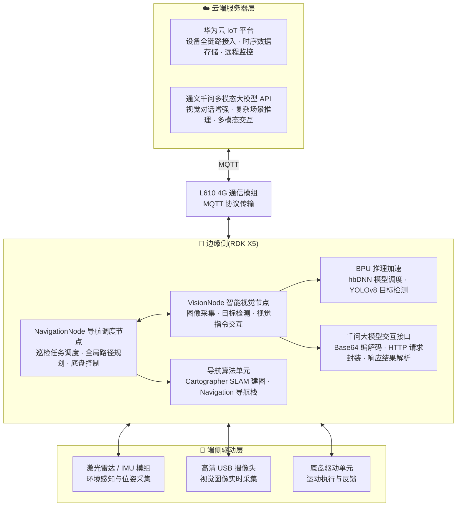

# ⚡ 基于RDK X5的智慧实验室多模态巡检系统

> 赛事:全国大学生嵌入式芯片与系统设计竞赛 
> 奖项:全国三等奖
> 年份:2026
> 平台:RDK X5/L610
> 团队:Labsteward · 南京大学

## 📖 作品简介

本作品针对传统实验室管理高度依赖人工巡查、设备归位难、物品易遗漏等痛点，基于RDK X5边缘计算平台，打造集自动巡逻、AI视觉识别、云端监控于一体的智慧实验室巡检系统。系统搭载智能巡检小车，通过SLAM技术实现自主巡逻，利用YOLOv5视觉模型实现多目标视觉识别，并通过广和通 L610通信模块将异常数据同步至云端，引入VLM模型辅助深度语义分析，从而精准检测设备摆放规范、物品归位状态及各类遗落物品，分析结果通过云端实时推送至监测平台，实现了实验室管理的智能化、可视化与标准化，显著提升了管理效率与安全水平。

## 🧠 核心功能

- 自主导航巡航:Cartographer SLAM 建图 + Navigation 导航栈,多工位巡检任务调度与底盘控制
- 视觉智能识别:BPU 加速 YOLOv8 目标检测,自动拍照留证
- 多模态视觉交互:通义千问大模型,视觉对话增强与复杂场景推理
- 云端物联:L610 4G 模组 MQTT 接入华为云 IoT 平台,设备状态与告警实时上报
- Web 可视化:巡检任务下发、结果查询与数据大屏
- 微信小程序:随时随地查看巡检进度与结果

## 🏗️ 系统架构

系统采用“云-边-端”协同架构:



### 分层说明

| 层次 | 模块 | 职责 |
| ---- | ---- | ---- |
| 云端服务器层 | 华为云 IoT 平台 | 设备全链路接入、时序数据存储、远程监控 |
| 云端服务器层 | 通义千问多模态大模型 API | 视觉对话增强、复杂场景推理、多模态交互 |
| 通信 | L610 4G 通信模组 | MQTT 协议传输 |
| 边缘侧 | NavigationNode | 巡检任务调度、全局路径规划、底盘控制 |
| 边缘侧 | VisionNode | 图像采集、目标检测、视觉指令交互 |
| 边缘侧算法层 | 导航算法单元 | Cartographer SLAM 建图、Navigation 导航栈 |
| 边缘侧算法层 | BPU 推理加速 | hbDNN 模型调度、YOLOv8 目标检测 |
| 边缘侧算法层 | 千问大模型交互接口 | Base64 编解码、HTTP 请求封装、响应结果解析 |
| 端侧驱动层 | 激光雷达 / IMU 模组 | 环境感知与位姿采集 |
| 端侧驱动层 | 高清 USB 摄像头 | 视觉图像实时采集 |
| 端侧驱动层 | 底盘驱动单元 | 运动执行与反馈 |

## 📂 目录结构

```
├── README.md               # 项目说明文件
├── docs/                   # 项目文档、设计报告、参考资料
├── hardware/               # 硬件设计资料
├── edge_computing/         # 边缘计算与智能算法
│   └── lab_inspection/     # ROS2 巡检主包(导航 + 视觉 + 配置)
│       ├── src/            # C++ 节点源码
│       ├── scripts/        # Python 辅助脚本
│       ├── config/         # Nav2 / YOLO 参数
│       ├── launch/         # 启动文件
│       ├── maps/           # 地图文件
│       └── models/         # YOLOv8 模型
├── cloud/                  # 云端平台服务
│   └── web_frontend/       # Web 数据可视化前端 + 小程序
└── tools/                  # 辅助工具与调试脚本
    ├── l610_at_test.py     # L610 4G 模组 AT 指令调试/健康检查
    ├── check_env.sh        # 机器人环境健康检查
    ├── clean_runtime_data.sh # 清理巡检照片与上传数据
    └── record_rosbag.sh    # 录制数据包用于离线调试
```

## 🚀 快速开始

### 边缘端(RDK X5 / 装有 ROS2 Humble 的机器)

```bash
cd edge_computing
source /opt/ros/humble/setup.bash
colcon build
source install/setup.bash
ros2 launch lab_inspection lab_inspection.launch.py
# 或一键启动巡航(从工位 1 开始):
#   ./src/lab_inspection/scripts/start_cruise.sh
```

### 云端(Web 平台)

```bash
cd cloud/web_frontend
npm install
node sever.js
```

> 云端凭证请在 `.env` 中配置(参考 `.env.example`),小程序端在 `cloud/web_frontend/小程序` 目录。

## 📄 许可证

Apache-2.0
